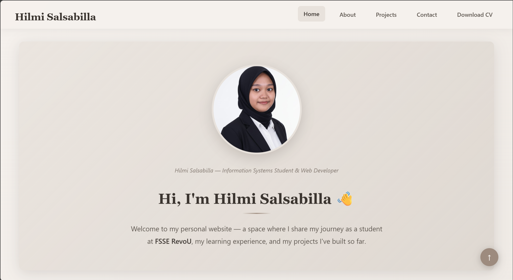
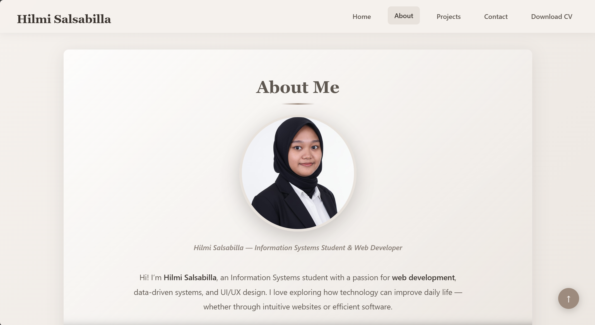
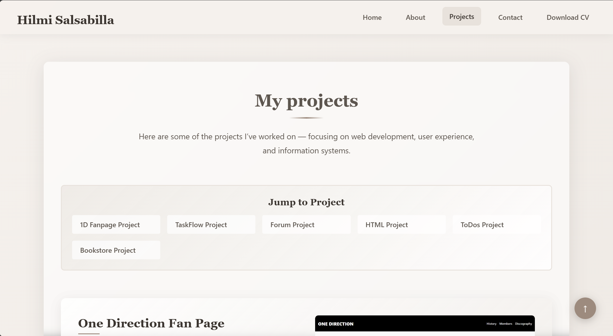
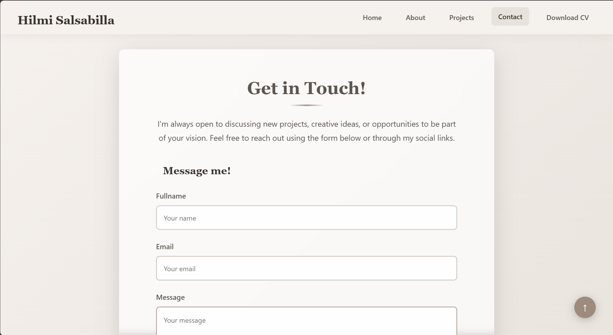

# 🌟 Hilmi Salsabilla | Personal Portfolio Website

[](https://revou-fsse-oct25.github.io/milestone-1-HilmiSalsabilla/)
[](https://github.com/Revou-FSSE-Oct25/milestone-1-HilmiSalsabilla)

> A modern and responsive personal portfolio website built with HTML5 and CSS3 as part of the RevoU FSSE Program Milestone 1.

## 📖 About This Project

This is my personal portfolio website where I showcase my journey as a developer. The website features a clean, modern design with smooth navigation and fully responsive layout that works seamlessly across all devices.

**🔗 Live Website:** [hilmisalsabilla.dev](https://revou-fsse-oct25.github.io/milestone-1-HilmiSalsabilla/)

## 📋 List of Contents

- [📖 About This Project](#-about-this-project)
- [✨ Features](#-features)
- [🛠️ Technologies Used](#️-technologies-used)
- [📂 Project Structure](#-project-structure)
- [🖼️ Website Preview](#️-website-preview)
    - [Homepage](#homepage)
    - [About Page](#about-page)
    - [Projects Page](#projects-page)
    - [Contact Page](#contact-page)
- [🚀 Getting Started](#-getting-started)
    - [Prerequisites](#prerequisites)
    - [Installation](#installation)
    - [Deployment](#deployment)
- [📝 Development Workflow](#-development-workflow)
- [🎯 Future Enhancements](#-future-enhancements)
- [📊 Learning Outcomes](#-learning-outcomes)
- [🤝 Contributing](#-contributing)
- [📄 License](#-license)
- [📬 Contact](#-contact)

## ✨ Features

- 🏠 **Home Section** - An engaging introduction and welcome message
- 👨‍💻 **About Section** - Comprehensive overview of my education, experience, skills, and interests
- 💼 **Projects Section** - Showcase of my completed and ongoing projects
- 📬 **Contact Section** - Multiple ways to connect with me including social links and contact form
- 📱 **Fully Responsive** - Optimized for desktop, tablet, and mobile devices
- 🎨 **Modern UI/UX** - Clean and intuitive user interface
- ⚡ **Fast Loading** - Optimized performance with lightweight code

## 🛠️ Technologies Used

- **HTML5** - Semantic markup for better SEO and accessibility
- **CSS3** - Modern styling with Flexbox and Grid
- **Git & GitHub** - Version control and deployment
- **GitHub Pages** - Free hosting and continuous deployment

## 📂 Project Structure

```
milestone-1-HilmiSalsabilla/
├── assets/
│   ├── css/
│   │   ├── index.css       # Homepage styles
│   │   ├── about.css       # About page styles
│   │   ├── projects.css    # Projects page styles
│   │   └── contact.css     # Contact page styles
│   ├── document/           # PDF files and documents
│   ├── images/             # Image assets
│   ├── logo/               # Logo files
│   ├── preview/            # Preview screenshots
│   │   ├── pages/          # Page screenshots
│   │   └── projects/       # Project screenshots
├── pages/
│   ├── about.html          # About page
│   ├── contact.html        # Contact page
│   └── projects.html       # Projects page
├── index.html              # Homepage
└── README.md               # Documentation
```

## 🖼️ Website Preview

### Homepage


### About Page


### Projects Page


### Contact Page


## 🚀 Getting Started

### Prerequisites

- A modern web browser (Chrome, Firefox, Safari, or Edge)
- Git installed on your computer
- Code editor (VS Code, Sublime Text, etc.)

### Installation

1. **Clone the repository**
   ```bash
   git clone https://github.com/Revou-FSSE-Oct25/milestone-1-HilmiSalsabilla.git
   ```

2. **Navigate to the project directory**
   ```bash
   cd milestone-1-HilmiSalsabilla
   ```

3. **Open in your browser**
   - Simply open `index.html` in your preferred web browser
   - Or use a local server like Live Server extension in VS Code

### Deployment

This website is automatically deployed to GitHub Pages. Any push to the `main` branch will trigger a new deployment.

## 📝 Development Workflow

1. Create a new feature branch
   ```bash
   git checkout -b feature/your-feature-name
   ```

2. Make your changes and commit
   ```bash
   git add .
   git commit -m "Add: your feature description"
   ```

3. Push to GitHub
   ```bash
   git push origin feature/your-feature-name
   ```

4. Create a Pull Request on GitHub

## 🎯 Future Enhancements

- [ ] Add dark mode toggle
- [ ] Implement JavaScript animations
- [ ] Add blog section
- [ ] Integrate contact form with backend
- [ ] Add more project showcases
- [ ] Add multi-language support

## 📊 Learning Outcomes

Through this project, I've learned:

- ✅ Semantic HTML5 structure and best practices
- ✅ Advanced CSS3 styling techniques
- ✅ Responsive web design principles
- ✅ Git version control workflow
- ✅ GitHub Pages deployment
- ✅ Web accessibility standards
- ✅ Project organization and file structure

## 🤝 Contributing

This is a personal project, but feedback and suggestions are always welcome! Feel free to:

1. Fork the repository
2. Create your feature branch
3. Submit a pull request

## 📄 License

This project is open source and available under the [MIT License](LICENSE).

## 📬 Contact

**Hilmi Salsabilla**

- 🌐 Website: [hilmisalsabilla.dev](https://revou-fsse-oct25.github.io/milestone-1-HilmiSalsabilla/)
- 💼 LinkedIn: [Connect with me](https://linkedin.com/in/hilmisalsabilla)
- 📧 Email: [Email me](hilmisalsabilla6@gmail.com)
- 🐙 GitHub: [@HilmiSalsabilla](https://github.com/HilmiSalsabilla)

---

<div align="center">

**⭐ If you like this project, please give it a star! ⭐**

Made with ❤️ by Hilmi Salsabilla | RevoU FSSE Oct 2025

[↑ Back to top](#-hilmi-salsabilla--personal-portfolio-website)

</div>